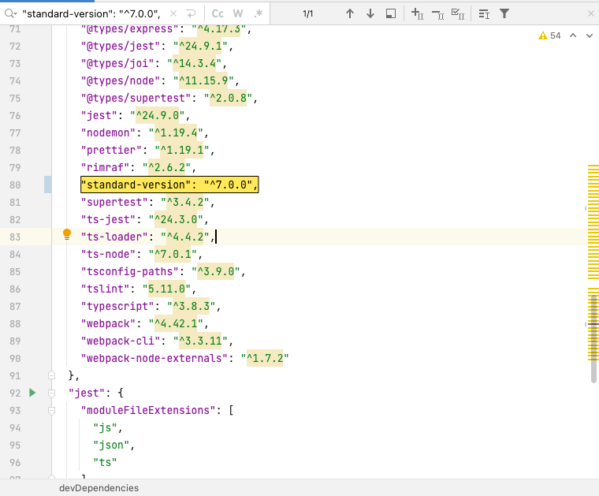
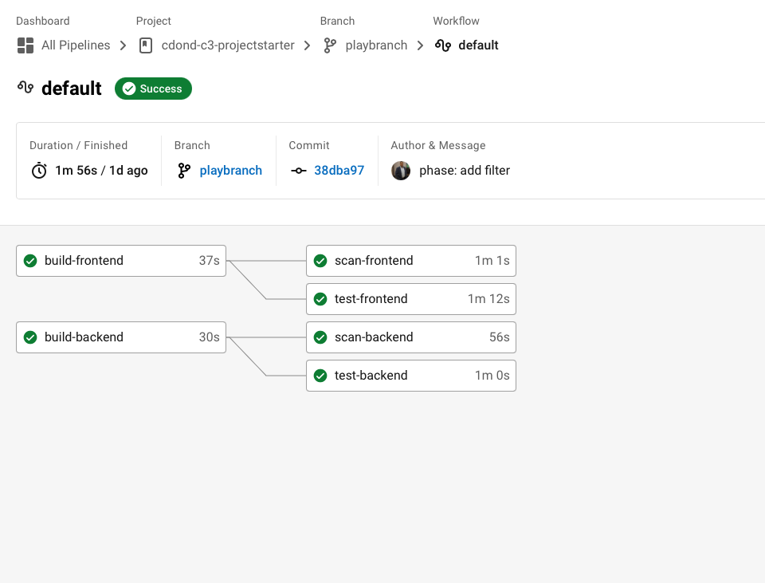

# Second release notes
## Section 2: Deploying Working, Trustworthy Software

### 7) All critical security vulnerabilities caught by the “Analyze” job have been fixed.

## Section 2: second note list
### 3) Console output of a successful rollback after a failed smoke test. [SCREENSHOT07]
???

### 6) Evidence that deploys jobs only happen on the master branch. [SCREENSHOT10]

### 7) Evidence of deployed and functioning front-end application in an S3 bucket [URL02] 
1. URL01 (github): https://github.com/ehabrefaat82/cdond-c3-projectstarter
2. URL02 (cloudfront): https://d30qcnsjamg0r7.cloudfront.net/#/employees 
3. URL03 (frontend_aws-ec2):
4. URL04 (backend):  