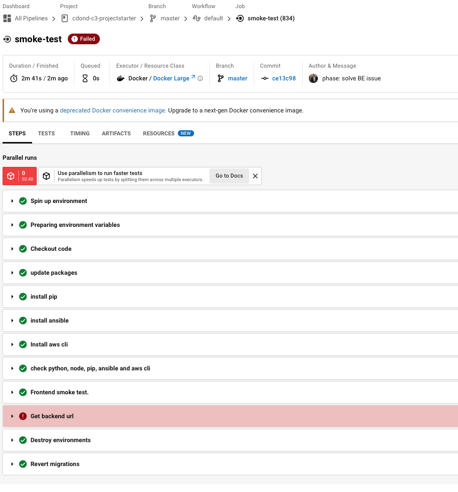
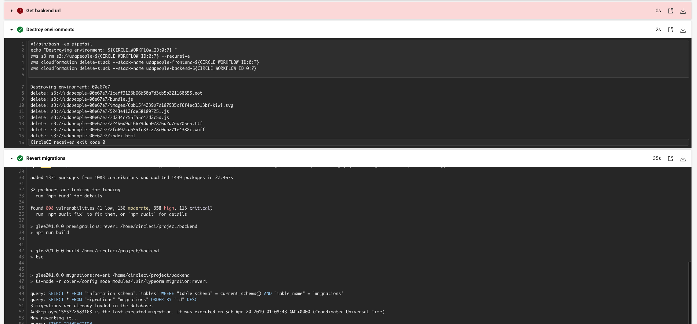
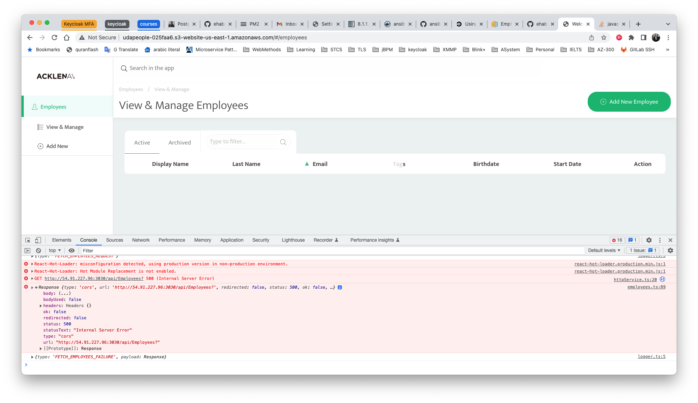
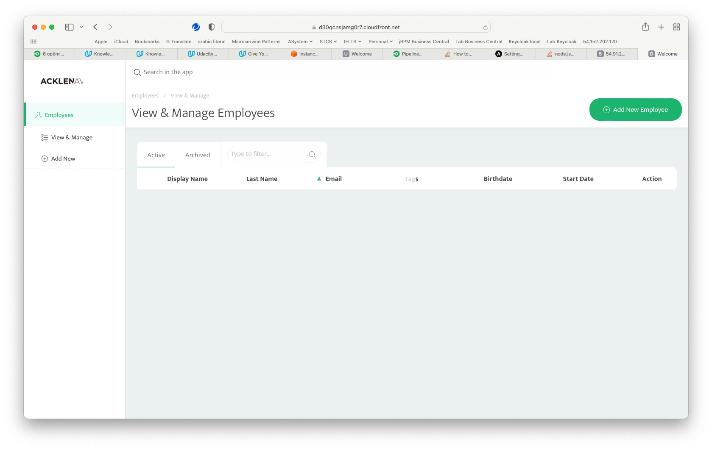
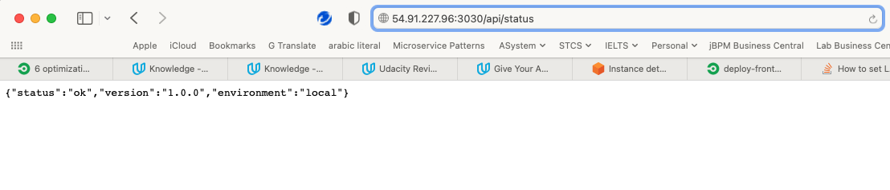
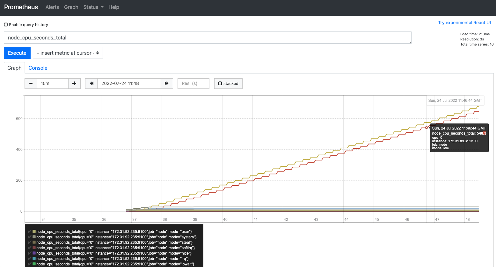
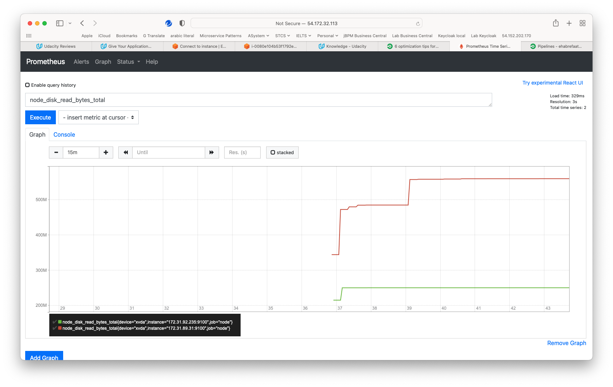
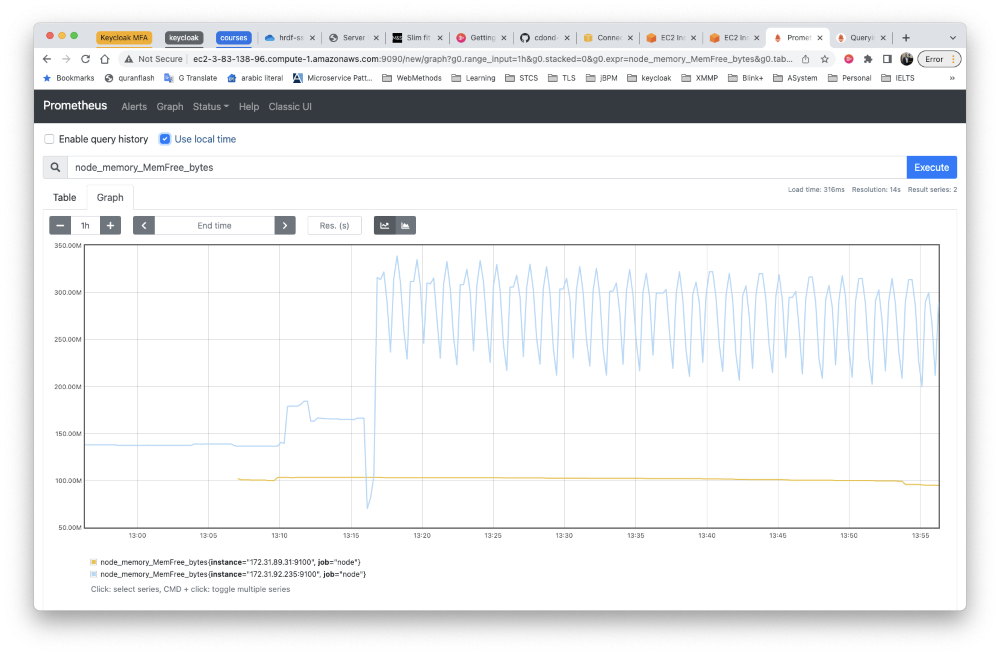
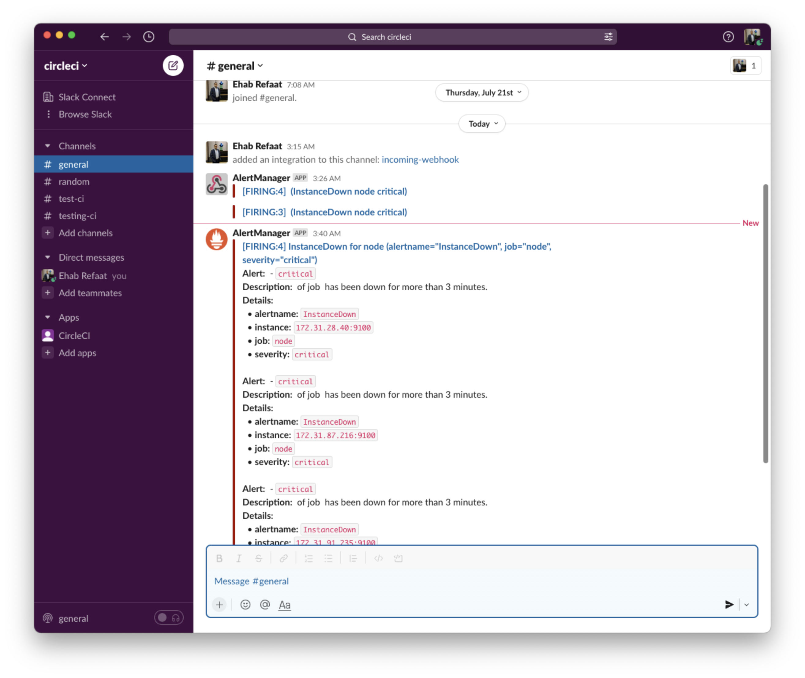

# Second release notes
## Section 2: Deploying Working, Trustworthy Software

### 7) All critical security vulnerabilities caught by the “Analyze” job have been fixed.

## Section 2: second note list
### 3) Console output of a successful rollback after a failed smoke test. [SCREENSHOT07]

### 6) Evidence that deploys jobs only happen on the master branch. [SCREENSHOT10]

### 7) Evidence of deployed and functioning front-end application in an S3 bucket [URL02_SCREENSHOT]
#### URL02 (frontend_aws-ec2): http://udapeople-025faa6.s3-website-us-east-1.amazonaws.com/#/employees
## Note: due to CORS FE can't access BE

### 8) Evidence of deployed and functioning Frontend in CloudFront. [URL03_SCREENSHOT]
#### 3. URL03 (cloudfront): https://d30qcnsjamg0r7.cloudfront.net/#/employees

### 9) Evidence of healthy back-end application. [URL04_SCREENSHOT]
#### 4. URL04 (backend):  http://54.91.227.96:3030/api/status

## Section 3: Turn Errors into Sirens
### 2) :x: Evidence that Prometheus is monitoring memory, CPU and disk usage of EC2 instances. [SCREENSHOT11]
#### CPU

#### disk

#### Memory

### 3) Evidence that Prometheus and AlertManager send alerts when certain conditions exist in the EC2 instance. [SCREENSHOT12]
