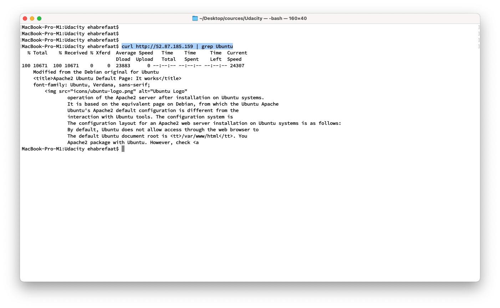

# Submission 03

### URL01 (github)
https://github.com/ehabrefaat82/cdond-c3-projectstarter
### URL02 (frontend) TODO: change to the latest result
http://udapeople-864bbda.s3-website-us-east-1.amazonaws.com/#/employees 

## Images Notes
### Screenshot 03
* npm audi --fix will not solve the issue.
* I spent a lot of time to fix with no hope
* Unfortunately I don't know node at all.
* I removed audit from the phase to continue

### Screenshot 06
* backend is not accessible because of npm and pm2

* As an evidence to the issue from pm2, I installed apache server enabled port 80,below the result.
* 

